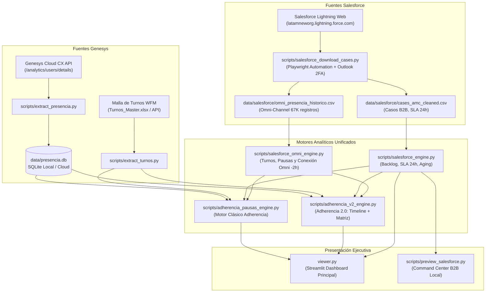

# CONTEXT.md - Sistema Integral de Presencia, Adherencia y Operación (Genesys Cloud CX & Salesforce B2B)

> **Última Actualización:** 18 de septiembre de 2026 - 07:58 COT  
> **Autor / Arquitectura:** Carlos Murillo & Equipo de Inteligencia Operativa 4DX  
> **Repositorio:** `carlosmurilloealmacontact/presencia-genesys` (`origin/main`)  
> **Entorno:** Local (Windows / PowerShell / Python 3.14) & Nube (Streamlit Cloud)

---

## 1. Visión y Alcance del Proyecto

El sistema es una plataforma analítica y de monitoreo operativo de alto nivel diseñada para **AlmaContact y LATAM Airlines**, que unifica dos ecosistemas de atención hasta ahora desconectados:
1. **Canal Telefónico y Voz:** Monitoreo segundo a segundo de agentes en **Genesys Cloud CX** (presencia, estados en cola, pausas reglamentarias, adherencia a turnos WFM, ausentismo y GTR).
2. **Canal Digital y Backoffice (Agencias B2B):** Monitoreo de ejecutivos y analistas que gestionan **Salesforce** (Casos, SLA 24h, envejecimiento de backlog y chats de **Omni-Channel**).

### Problema Operativo Resuelto
Históricamente, los asesores de Agencias B2B que no toman llamadas en Genesys pero sí gestionan decenas de casos o atienden chats en Salesforce aparecían injustamente como *"❌ Ausentes"* en las mallas de adherencia. El sistema rescata automáticamente esta presencia y unifica la medición de productividad.

---

## 2. Arquitectura General del Ecosistema

---

## 3. Estado Actual: ¿Qué está FULL (100% Operativo)?

### A. Canal Genesys Cloud CX
* **Extracción de Presencia:** Script `extract_presencia.py` sincroniza segundo a segundo todos los cambios de estado (`AVAILABLE`, `MEAL`, `BREAK`, `AWAY`, `TRAINING`, etc.) para las sedes AMC Bogotá y Medellín.
* **Malla de Turnos:** Integración y lectura de turnos programados con tolerancia, descansos asignados y jornadas laborales.
* **Adherencia Clásica:** Cálculo de adherencia global, tramos de conexión y cumplimiento de pausas reglamentarias.
* **Adherencia 2.0:** Vista matricial y línea de tiempo interactiva con desglose de estados, diferencias minuto a minuto y semáforo visual de cumplimiento.
* **GTR (Gestión en Tiempo Real):** Monitoreo de colas, AHT, llamadas entrantes, abandonos y simultaneidad.
* **Ausentismo y Jerarquía:** Catalogación de ausentismo justificado vs injustificado, supervisores y coordinadores.

### B. Módulo de Casos Salesforce B2B (Backoffice)
* **Ingesta Automatizada:** Playwright con persistencia de cookies (`storage_state.json`) y resolución de desafíos de identidad (2FA) leyendo el código de verificación directamente de Microsoft Outlook vía MAPI local (`salesforce_auth_manager.py`).
* **KPIs de Backlog:** Cálculo de casos en proceso, casos sin asignar, infracción de SLA 24h y distribución por antigüedad (*Aging* <24h, 1-3d, 4-7d, 8-15d, >30d).
* **Demanda Horaria:** Matriz de creación vs cierre de casos por franja horaria.

### C. Rescate B2B en Adherencia por Casos
* **Reclasificación Automática:** Si un asesor de Agencias B2B no tiene registros de login en Genesys pero gestionó casos en Salesforce durante su fecha de turno, el motor lo rescata automáticamente cambiándolo de *"❌ Ausente"* a **`🔵 Conectado en Salesforce (X Casos)`**, calculando sus horas efectivas de gestión.
* **Paridad Total:** Implementado y verificado tanto en la vista clásica (`adherencia_pausas_engine.py`) como en Adherencia 2.0 (`adherencia_v2_engine.py`), desplegado y sincronizado con `origin/main`.

### D. Descarga y Configuración del Reporte Omni-Channel
* **Enlace Oficial Configurado:** Guardado en `data/salesforce_config.json`:
  * URL: `https://latamneworg.lightning.force.com/lightning/r/Report/00OVK00000APrzR2AT/view`
  * Filtro: **Últimos 7 días** (semana rodante para descargas ultrarrápidas).
* **Rutina de Descarga:** `descargar_reporte_omni()` integrada en `scripts/salesforce_download_cases.py` (ejecutable con `python scripts/salesforce_download_cases.py --omni`).
* **Base Histórica Asegurada:** 67.604 registros de 212 asesores (desde julio de 2026) almacenados en `data/salesforce/omni_presencia_historico.csv`.

---

## 4. Hallazgos Técnicos y Parámetros Validados

### 1. Zona Horaria de Salesforce Omni-Channel
* **Confirmación Empírica:** El reporte de Salesforce se exporta en **UTC-3 (Hora de Chile / Santiago)**, el huso predeterminado de la organización de LATAM Airlines.
* **Fórmula de Conversión a Colombia (UTC-5):**
  $$\text{Hora Colombia} = \text{Hora CSV} - 2\text{ horas}$$
* **Comprobación:** Cruce exacto con la malla de turnos:
  * Claribeth Pérez (Turno 07:00 $\rightarrow$ CSV 09:01 $\rightarrow$ **07:01 COT**).
  * Angelo Barrera (Turno 07:00 $\rightarrow$ CSV 09:03 $\rightarrow$ **07:03 COT**).

### 2. Meta de Simultaneidad en WhatsApp
* **Definición Operativa:** Fijada en **3.0 casos simultáneos** para todos los servicios y colas que operan canal WhatsApp en Genesys Cloud CX.
* **Medición:** Algoritmo *sweep-line* sobre eventos de interacción para calcular concurrencia ponderada real y % de tiempo al 1x, 2x y 3x+.

### 4. Regla de Oro de Marely Cardona: Aislamiento Agencias B2B vs LATAM Pasajeros
* **Definición Operativa Canónica:** A menos de indicación contraria de Carlos Murillo, **toda persona cuyo jefe directo (supervisor) o coordinador sea Marely Cardona (`CARDONA RAMIREZ MARELYN`) pertenece exclusivamente al servicio de Agencias B2B**.
* **Blindaje:** No debe aparecer en ningún reporte, selector o métrica de LATAM Pasajeros.
* **Viceversa Estricto:** Dentro de Agencias B2B no debe aparecer nadie que no sea del equipo de Marely Cardona.
* **Exclusiones Críticas Blindadas:**
  * `CARDONA BARRAGAN CATALINA` (Catalina Cardona): Supervisora de **LATAM Pasajeros** (`LUA AMC` / `LUA AMC ING`) bajo Andrés Rojas Leguizamo. Blindada y excluida 100% de B2B.
  * `BO_CUS_COL` (Andrés Rojas) y `BO_WAIVERS` (Oscar Roldán): Servicios de **LATAM Pasajeros**, retirados de palabras clave B2B.
* **Supervisores Directos Canónicos de Marely Cardona:**
  1. `AGUIRRE GUISAO DIEGO ALEJANDRO`
  2. `GUISAO BARRERA JESUS ALONSO`
  3. `HERNANDEZ ISAZA CRISTIAN EDUARDO`
  4. `MENDEZ TELLECHEA ORDALIS VERONICA`
  5. `MORENO HURTADO DEINER ANDRES`
  6. `PEREZ METAUTE MARIA ISABEL`
  7. `RESTREPO URIBE EMANUEL`
  8. `OCHOA GARCIA SANDRA JANNETH`
  9. `CARDONA RAMIREZ MARELYN` (gestión directa)

---

## 5. Estado Actual de Tareas

| Tarea | Descripción | Estado |
| :--- | :--- | :---: |
| **1. Motor Omni-Channel (`salesforce_omni_engine.py`)** | Procesador que toma `omni_presencia_historico.csv`, aplica $-2\text{h}$, normaliza nombres contra BPs y calcula primer login, pausas `On_Break` y salida por día. | 🟢 **FULL (100% Operativo)** |
| **2. Fusión Omni en Adherencia Pausas** | Conexión de tramos `On_Break` y presencia de Salesforce Omni a `adherencia_pausas_engine.py` y `adherencia_v2_engine.py` (rescate de jornada y validación de descansos). | 🟢 **FULL (100% Operativo)** |
| **3. Automatización en Pipeline (`pipeline_pasos.bat`)** | Integración de `extract_turnos.py` en paso `[8/10]` y `sync_salesforce_daily.py` en paso `[10/10]`. | 🟢 **FULL (100% Operativo)** |
| **4. Meta de Simultaneidad WhatsApp (3.0x)** | Configuración e integración de la meta de 3 casos simultáneos en el motor de análisis y métricas ejecutivas. | 🟢 **FULL (100% Operativo)** |
| **5. Regla de Oro Marely Cardona (`b2b_scope_engine.py`)** | Motor autoritativo de aislamiento B2B vs Pasajeros, corrección de fugas (Catalina Cardona, BO_CUS, BO_WAIVERS, casos ajenos en Salesforce). | 🟢 **FULL (100% Operativo)** |
| **6. Auditoría de Dispositivo (PC vs Móvil)** | Detección de hardware a nivel de usuario en masa. | ❌ **Descartado / Fuera de Alcance** |

---

## 6. Catálogo de Scripts y Estatus en Automatización

| Script | Ubicación | Estatus Automatización | Ejecución / Paso en Pipeline |
| :--- | :--- | :---: | :--- |
| `extract_presencia.py` | `scripts/` | 🟢 Automatizado | `pipeline_pasos.bat` paso `[8/10]` (Diario) |
| `extract_turnos_api.py` | `scripts/` | 🟢 Automatizado | `pipeline_pasos.bat` paso `[8/10]` (Diario - API Almaverso) |
| `export_cloud.py` | `scripts/` | 🟢 Automatizado | `pipeline_pasos.bat` paso `[8/10]` (Diario) |
| `zendesk_hourly_worker.py` | `scripts/` | 🟢 Automatizado | `pipeline_pasos.bat` paso `[9/10]` (Cada hora) |
| `sync_salesforce_daily.py` | `scripts/` | 🟢 Automatizado | `pipeline_pasos.bat` paso `[10/10]` (Diario) |
| `salesforce_omni_engine.py` | `scripts/` | 🟢 Indirecto | Invocado por `sync_salesforce_daily.py` |
| `salesforce_b2b_engine.py` | `scripts/` | 🟢 Indirecto | Invocado por `sync_salesforce_daily.py` |
| `b2b_scope_engine.py` | `scripts/` | 🟢 En Tiempo Real | Invocado por dashboards y motores |
| `adherencia_pausas_engine.py` | `scripts/` | 🟢 En Tiempo Real | Motor analítico de Streamlit |
| `adherencia_v2_engine.py` | `scripts/` | 🟢 En Tiempo Real | Motor analítico de Streamlit |
| `agencias_b2b_engine.py` | `scripts/` | 🟢 En Tiempo Real | Motor analítico de Streamlit |
| `live_engine.py` | `scripts/` | 🟢 En Tiempo Real | Motor analítico de Streamlit |
| `mapeo_socios_engine.py` | `scripts/` | 🟡 Bajo Demanda | Actualiza `maestro_asesores_b2b.json` con Google Sheets |

---

## 7. Inventario de Archivos Clave

* **Visor Principal:** [`viewer.py`](file:///c:/Proyecto%203.0/Paneles%20y%20Dashboard%204dx/Seguimiento%20Presencia%20Genesys/viewer.py) (Dashboard Streamlit de Producción).
* **Definición Autoritativa de Ámbito:** [`scripts/b2b_scope_engine.py`](file:///c:/Proyecto%203.0/Paneles%20y%20Dashboard%204dx/Seguimiento%20Presencia%20Genesys/scripts/b2b_scope_engine.py) (Regla de Oro de Marely Cardona).
* **Motores de Adherencia:**
  * [`scripts/adherencia_pausas_engine.py`](file:///c:/Proyecto%203.0/Paneles%20y%20Dashboard%204dx/Seguimiento%20Presencia%20Genesys/scripts/adherencia_pausas_engine.py) (Adherencia clásica + rescate unificado Omni y Casos).
  * [`scripts/adherencia_v2_engine.py`](file:///c:/Proyecto%203.0/Paneles%20y%20Dashboard%204dx/Seguimiento%20Presencia%20Genesys/scripts/adherencia_v2_engine.py) (Adherencia 2.0 Timeline y Matriz).
  * [`scripts/salesforce_omni_engine.py`](file:///c:/Proyecto%203.0/Paneles%20y%20Dashboard%204dx/Seguimiento%20Presencia%20Genesys/scripts/salesforce_omni_engine.py) (Motor analítico de presencia Omni -2h).
  * [`scripts/whatsapp_simultaneidad_engine.py`](file:///c:/Proyecto%203.0/Paneles%20y%20Dashboard%204dx/Seguimiento%20Presencia%20Genesys/scripts/whatsapp_simultaneidad_engine.py) (Simultaneidad WhatsApp con meta 3.0x).
* **Automatización y Descargas:**
  * [`pipeline_pasos.bat`](file:///c:/Proyecto%203.0/Paneles%20y%20Dashboard%204dx/pipeline_pasos.bat) (Pipeline centralizado de 10 pasos con notificaciones Telegram).
  * [`scripts/sync_salesforce_daily.py`](file:///c:/Proyecto%203.0/Paneles%20y%20Dashboard%204dx/Seguimiento%20Presencia%20Genesys/scripts/sync_salesforce_daily.py) (Orquestador de sincronización diaria de Casos y Omni).
  * [`scripts/salesforce_download_cases.py`](file:///c:/Proyecto%203.0/Paneles%20y%20Dashboard%204dx/Seguimiento%20Presencia%20Genesys/scripts/salesforce_download_cases.py) (Descarga de Casos, Logins y Omni).
  * [`scripts/salesforce_auth_manager.py`](file:///c:/Proyecto%203.0/Paneles%20y%20Dashboard%204dx/Seguimiento%20Presencia%20Genesys/scripts/salesforce_auth_manager.py) (Sesión Playwright + 2FA Outlook MAPI).
  * [`data/salesforce_config.json`](file:///c:/Proyecto%203.0/Paneles%20y%20Dashboard%204dx/Seguimiento%20Presencia%20Genesys/data/salesforce_config.json) (URLs oficiales de reportes).
* **Datos y Almacenamiento Salesforce:**
  * `data/salesforce/cases_amc_cleaned.pkl` (Casos B2B procesados y clasificados).
  * `data/salesforce/omni_presencia_historico.csv` (Base histórica Omni-Channel 67K registros).
  * `data/salesforce/omni_presencia_resumen.pkl` (Cache analítico diario por BP de Omni).
  * `data/salesforce/sync_history.log` (Bitácora de auditoría de descargas).

