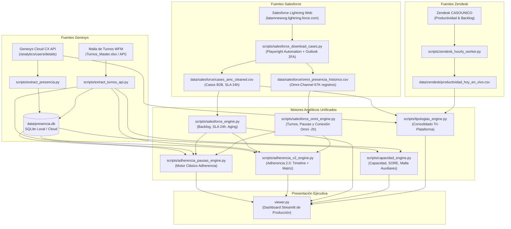

# CONTEXT.md - Sistema Integral de Presencia, Adherencia y Operación (Genesys Cloud CX, Salesforce B2B & Zendesk CASOUNICO)

> **Última Actualización:** 18 de septiembre de 2026 - 19:40 COT  
> **Autor / Arquitectura:** Carlos Murillo & Equipo de Inteligencia Operativa 4DX  
> **Repositorio:** `carlosmurilloealmacontact/presencia-genesys` (`origin/main`)  
> **Entorno:** Local (Windows / PowerShell / Python 3.14) & Nube (Streamlit Cloud)

---

## 1. Visión y Alcance del Proyecto

El sistema es una plataforma analítica y de monitoreo operativo de alto nivel diseñada para **AlmaContact y LATAM Airlines**, que unifica tres ecosistemas de atención y gestión:
1. **Canal Telefónico y Voz:** Monitoreo segundo a segundo de agentes en **Genesys Cloud CX** (presencia, estados en cola, pausas reglamentarias, adherencia a turnos WFM, ausentismo, GTR y dimensionamiento SORE).
2. **Canal Digital y Backoffice (Agencias B2B):** Monitoreo de ejecutivos y analistas que gestionan **Salesforce** (Casos, SLA 24h, envejecimiento de backlog y chats de **Omni-Channel**).
3. **Mesa Back Office Pasajeros (Zendesk CASOUNICO):** Integración en vivo de productividad y backlog para tipologías operativas (*LATAM Pass*, *Equipajes*, *Devoluciones*, *Check-in*, *Ancillaries*, etc.).

### Problemas Operativos Resueltos
1. **Injusticia en Adherencia B2B:** Históricamente, los asesores de Agencias B2B que no toman llamadas en Genesys pero sí gestionan decenas de casos o atienden chats en Salesforce aparecían como *"❌ Ausentes"*. El sistema los rescata automáticamente.
2. **Punto Ciego de Timeouts en Tipificaciones:** Las llamadas que cerraban por vencimiento del temporizador de ACW en Genesys quedaban como `ININ-WRAP-UP-TIMEOUT` sin motivo de negocio. El motor reclasifica inteligentemente el 100% del tráfico por cola y contexto de servicio.
3. **Distorsión del Balance de Personal (FTEs):** La comparación de FTEs Conectados Brutos frente al Requerido creaba una falsa impresión de sobrecontratación (+165 personas). Se desdobló la métrica para transparentar los **FTEs Efectivos Disponibles** y contrastar los **Auxiliares Programados en Malla vs Reales**.

---

## 2. Arquitectura General del Ecosistema

---

## 3. Estado Actual: ¿Qué está FULL (100% Operativo)?

### A. Canal Genesys Cloud CX
* **Extracción de Presencia:** Script `extract_presencia.py` sincroniza segundo a segundo los cambios de estado (`AVAILABLE`, `MEAL`, `BREAK`, `AWAY`, `TRAINING`, etc.) para AMC Bogotá y Medellín.
* **Malla de Turnos:** Integración vía API de Almaverso (`extract_turnos_api.py`) con auditoría de cambios y persistencia en `turnos_detallados`.
* **Adherencia 2.0:** Vista matricial y línea de tiempo interactiva con desglose de estados, diferencias minuto a minuto y semáforo visual de cumplimiento.
* **GTR (Gestión en Tiempo Real):** Monitoreo de colas, AHT, llamadas entrantes, abandonos y simultaneidad.
* **Ausentismo y Jerarquía:** Catalogación de ausentismo justificado vs injustificado por supervisores y coordinadores.

### B. Módulo de Casos Salesforce B2B (Backoffice)
* **Ingesta Automatizada:** Playwright con persistencia de cookies (`storage_state.json`) y resolución de desafíos de identidad (2FA) leyendo el código directamente de Microsoft Outlook vía MAPI local (`salesforce_auth_manager.py`).
* **KPIs de Backlog:** Cálculo de casos en proceso, casos sin asignar, infracción de SLA 24h y distribución por antigüedad (*Aging* <24h, 1-3d, 4-7d, 8-15d, >30d).
* **Demanda Horaria:** Matriz de creación vs cierre de casos por franja horaria.

### C. Rescate B2B en Adherencia por Casos y Omni
* **Reclasificación Automática:** Si un asesor de Agencias B2B no tiene login en Genesys pero gestionó casos o chats en Salesforce durante su turno, el motor lo rescata automáticamente cambiándolo de *"❌ Ausente"* a **`🔵 Conectado en Salesforce (X Casos)`**, calculando sus horas efectivas de gestión.
* **Paridad Total:** Activo en la vista clásica (`adherencia_pausas_engine.py`) y en Adherencia 2.0 (`adherencia_v2_engine.py`).

### D. Tipologías de Contacto & Detección de Contingencias (Tri-Plataforma)
* **Consolidación Genesys + Salesforce + Zendesk:** Extracción y homologación unificada de motivos de llamada (Genesys Wrap-Up Codes), interacciones Salesforce B2B y tickets gestionados en Zendesk CASOUNICO.
* **Resolución Geográfica de País / Mercado:** Detección automática por prefijos telefónicos (+56 Chile, +57 Colombia, +51 Perú, +1 USA, +34 España, etc.) y nomenclatura de colas.
* **Selector de 3 Lentes Analíticas de Demanda:**
  1. `🔍 Auditoría Operativa (Timeouts por Servicio)`: Visibiliza las llamadas cerradas por timeout catalogadas por campaña para supervisión.
  2. `🔮 Demanda Total Estimada (Reclasificación Inteligente por Cola)`: Reatribuye los timeouts a la especialidad de la cola de entrada, permitiendo analizar el **100% del tráfico** sin puntos ciegos.
  3. `🚫 Demanda Real Pura (Ocultar Timeouts)`: Aísla exclusivamente las interacciones donde el asesor tipificó manualmente.
* **Semáforo de Cumplimiento de Tipificación:** Auditoría para supervisores y monitores de calidad (🟢 $\ge 80\%$, 🟡 $60-79\%$, 🔴 $<60\%$).
* **Exportador Corporativo Multihélices:** Generación de reporte en Excel con 4 pestañas profesionales (Resumen Ejecutivo, Genesys Cloud, Salesforce B2B y Zendesk BO).

### E. Capacidad, Dimensionamiento SORE y Malla de Auxiliares
* **Scorecard Desdoblado (Opción B):**
  * **`Capacidad Neta`**: Minutos disponibles ÷ Minutos requeridos SORE.
  * **`FTEs Efectivos / Req`**: Dotación disponible neta productiva frente a la necesidad SORE (**378.0 / 404.5**, delta **-26.5 FTEs** en rojo).
  * **`Presencia Bruta`**: Total de asesores equivalentes conectados en cualquier estado (**569.7 FTEs**, delta **+165.2 logueados** en tono neutro).
  * **`% Auxiliares` & `Fuga Auxiliares`**: Medición de fuga por encima de la meta del 14% (930.9 horas = 116.4 asesores perdidos en pausas).
* **Comparativa de Auxiliares Programados vs Reales en la Matriz:**
  * **`Meta Aux`**: 14.0% oficial.
  * **`% Aux Prog`**: Porcentaje real programado en la malla de turnos (`turnos_detallados`), promediando **12.6%** para LATAM.
  * **`% Aux Real`**: Consumo medido en Genesys (**33.4%**).
  * **`Fuga Aux`**: Desvío directo entre realidad y programación (**+20.9%** en rojo).
  * **`FTE Disp`**: Columna con asesores netos disponibles por servicio.

---

## 4. Hallazgos Técnicos y Parámetros Validados

### 1. Zona Horaria de Salesforce Omni-Channel
* **Fórmula de Conversión a Colombia (UTC-5):**
  $$\text{Hora Colombia} = \text{Hora CSV} - 2\text{ horas}$$
* El reporte de Salesforce se exporta en UTC-3 (Hora de Chile / Santiago).

### 2. Meta de Simultaneidad en WhatsApp
* Fijada en **3.0 casos simultáneos** para todas las colas de WhatsApp en Genesys Cloud CX, calculada con algoritmo *sweep-line*.

### 3. Regla de Oro de Marely Cardona: Aislamiento Agencias B2B vs Pasajeros
* Toda persona bajo la supervisión o coordinación de Marely Cardona (`CARDONA RAMIREZ MARELYN`) pertenece exclusivamente a Agencias B2B.
* `CARDONA BARRAGAN CATALINA` (Catalina Cardona) es supervisora de **LATAM Pasajeros** (`LUA AMC`) y está excluida de B2B.

### 4. Hallazgo de Dimensionamiento en Redes Sociales (RRSS)
* **Auditoría de Archivos Fuente:** En los tres libros oficiales de septiembre (`09. Daily Forecast Sept - Latam.xlsx`, `09. Intraday Forecast IN Septiembre - Latam.xlsx` y `09. Intraday Forecast BO Septiembre - Latam.xlsx`), las hojas y columnas de Redes Sociales (`RRSS AMC`, `RRSS AMC ING`, `RRSS PORT AMC`, `RRSS ES`, `RRSS EN`) tienen la estructura creada pero sus valores de tráfico y asesores requeridos están en **0 o vacíos**.
* **Impacto:** Aunque en la operación hay más de 40 asesores conectados diariamente en RRSS, el modelo SORE los lee como `0 Req`, aportando +56.2 FTEs a la brecha bruta.
* **Acción Pendiente:** Preguntar al comité de WFM la próxima semana bajo qué plantilla o contrato se dimensionan estas horas.

### 5. Origen Real de la Fuga en Auxiliares (Malla 12.6% vs Real 33.4%)
* La programación de turnos de WFM está perfectamente calibrada y cumple el contrato: programa en promedio **12.6%** de descansos y diálogos 4DX (por debajo del 14% de meta).
* El desborde proviene íntegramente de la **disciplina en piso**, donde los asesores consumen en promedio **33.4%** de su jornada en estados auxiliares.

---

## 5. Catálogo de Scripts y Estatus en Automatización

| Script | Ubicación | Estatus | Propósito / Ejecución |
| :--- | :--- | :---: | :--- |
| `extract_presencia.py` | `scripts/` | 🟢 Automatizado | `pipeline_pasos.bat` paso `[8/10]` (Diario - Presencia Genesys) |
| `extract_turnos_api.py` | `scripts/` | 🟢 Automatizado | `pipeline_pasos.bat` paso `[8/10]` (Diario - API Turnos Almaverso) |
| `export_cloud.py` | `scripts/` | 🟢 Automatizado | `pipeline_pasos.bat` paso `[8/10]` (Diario - Exportación Nube) |
| `zendesk_hourly_worker.py` | `scripts/` | 🟢 Automatizado | `pipeline_pasos.bat` paso `[9/10]` (Cada hora - Zendesk CASOUNICO) |
| `sync_salesforce_daily.py` | `scripts/` | 🟢 Automatizado | `pipeline_pasos.bat` paso `[10/10]` (Diario - Casos, Omni, Chats y Cierre) |
| `cierre_b2b_autonomo_engine.py` | `scripts/` | 🟢 Automatizado | Consolidación diaria de cierre B2B independiente |
| `tipologias_engine.py` | `scripts/` | 🟢 En Tiempo Real | Consolidado Tri-Plataforma, 3 lentes de demanda y semáforo |
| `capacidad_engine.py` | `scripts/` | 🟢 En Tiempo Real | Capacidad SORE, Scorecard Opción B y Auxiliares Malla vs Real |
| `adherencia_v2_engine.py` | `scripts/` | 🟢 En Tiempo Real | Adherencia 2.0 (Timeline interactivo y matriz de turnos) |
| `adherencia_pausas_engine.py` | `scripts/` | 🟢 En Tiempo Real | Motor clásico de adherencia y rescate unificado |
| `b2b_scope_engine.py` | `scripts/` | 🟢 En Tiempo Real | Motor autoritativo de asignación B2B (Regla Marely Cardona) |
| `salesforce_engine.py` | `scripts/` | 🟢 En Tiempo Real | Dashboard analítico de Backlog, SLA 24h y Aging B2B |
| `salesforce_omni_engine.py` | `scripts/` | 🟢 En Tiempo Real | Motor analítico de presencia Omni-Channel (-2h) |
| `whatsapp_simultaneidad_engine.py` | `scripts/` | 🟢 En Tiempo Real | Monitoreo de concurrencia y simultaneidad WhatsApp (meta 3.0x) |
| `live_engine.py` | `scripts/` | 🟢 En Tiempo Real | Conexión WebSocket / API en vivo con Genesys Cloud |

---

## 6. Inventario de Archivos Clave

* **Visor Principal:** [`viewer.py`](file:///c:/Proyecto%203.0/Paneles%20y%20Dashboard%204dx/Seguimiento%20Presencia%20Genesys/viewer.py) (Dashboard Streamlit Multi-Pestaña de Producción).
* **Módulo de Capacidad y Dimensionamiento:** [`scripts/capacidad_engine.py`](file:///c:/Proyecto%203.0/Paneles%20y%20Dashboard%204dx/Seguimiento%20Presencia%20Genesys/scripts/capacidad_engine.py)
* **Módulo de Tipologías Tri-Plataforma:** [`scripts/tipologias_engine.py`](file:///c:/Proyecto%203.0/Paneles%20y%20Dashboard%204dx/Seguimiento%20Presencia%20Genesys/scripts/tipologias_engine.py)
* **Bases de Datos Locales:**
  * `data/presencia.db` (SQLite con tablas `segments`, `turnos_detallados`, `resumen_adherencia`).
  * `data/salesforce_live.db` (SQLite con interacciones y chats B2B).
* **Archivos Fuente de Dimensionamiento (SORE):**
  * `09. Daily Forecast Sept - Latam.xlsx`
  * `09. Intraday Forecast IN Septiembre - Latam.xlsx`
  * `09. Intraday Forecast BO Septiembre - Latam.xlsx`
* **Fuentes de Zendesk Back Office:**
  * `data/zendesk/productividad_hoy_en_vivo.csv`
  * `data/zendesk/productividad_diaria_fechas.csv`
  * `data/zendesk/productividad_historica_2026.parquet`
  * `data/zendesk/demanda_diaria_colas.csv`

---

## 9. Pipeline de Sincronización Zendesk y Demanda/Capacidad (Septiembre 2026)
* **Arquitectura de Sincronización:**
  * `scripts/zendesk_hourly_worker.py`: Demonio autónomo con arquitectura de 2 niveles:
    * **Tier 1 (Fast Sync - cada 5 min):** Extracción instantánea de conteos de backlog por cola (<2s) y productividad resuelta en vivo de hoy (`productividad_hoy_en_vivo.csv`).
    * **Tier 2 (Full Sync - cada 60 min):** Extracción profunda, tipologías completas y mantenimiento.
    * **Persistencia Continua:** `actualizar_historico_productividad()` actualiza en cada ciclo tanto `productividad_diaria_fechas.csv` como `productividad_historica_2026.parquet`.
    * **Recálculo de Demanda Automático:** `recalcular_demanda()` ejecuta `generar_demanda_diaria()` en cada ciclo para garantizar que `demanda_diaria_colas.csv` refleje inmediatamente las resoluciones y entradas sin rezago.
* **Blindaje de `generar_demanda_diaria.py`:**
  * Combina entradas históricas y en vivo (`created_at` convertido a UTC-5 America/Bogota) a partir de parquet, backlog activo y tickets de hoy.
  * Calcula salidas (`Casos_Resueltos`) fusionando `productividad_historica_2026.parquet`, `productividad_hoy_en_vivo.csv` y `productividad_diaria_fechas.csv` para garantizar que ninguna cola ni día muestre resoluciones en cero si hubo actividad.
* **Filtros de Fecha en `scripts/zendesk_engine.py`:**
  * Los botones de preset rápido (`7 días`, `15 días`, `30 días`, `Mes actual`, `Todo`) sincronizan explícitamente `st.session_state["zd_sel_fechas"]` con la tupla `(ini, fin)`, asegurando reactividad instantánea en el widget de Streamlit.
  * Incluye capa de defensa en profundidad en `cargar_bundle_zendesk()` para corroborar integridad de `Casos_Resueltos` en memoria.

---

## 10. Corrección de Intervalo UTC en Tipologías de Contacto (`scripts/tipologias_engine.py`)
* **Diagnóstico del Problema:** Después de las 7:00 PM hora de Colombia (00:00 UTC del día siguiente), la Analytics API de Genesys Cloud arrojaba error `400 Bad Request: The interval value is invalid`. La causa era que `inicio_utc` se calculaba como `ahora_utc.replace(hour=5)` (que tras las 00:00 UTC pasaba a ser las 05:00 UTC de mañana), mientras que `fin_utc` era la hora actual (01:00 UTC), quedando `inicio_utc > fin_utc`.
* **Impacto en el Dashboard:** Al fallar la llamada a Genesys Cloud, retornaba `0` llamadas, dejando únicamente los datos de Salesforce CRM Casos / Omni-Chat (que son casi en su totalidad Agencias B2B y Canales Indirectos). Esto provocaba que el gráfico de dona y treemap mostraran erróneamente un 80%+ de demanda de Agencias.
* **Solución:** Se implementó el cálculo del intervalo basado formalmente en la zona horaria de Colombia (`America/Bogota`, UTC-5). Con la corrección, Genesys Cloud aporta más de **14,500 interacciones (68% del volumen total)**, restaurando el balance operativo real de la tri-plataforma (Genesys 68%, Salesforce 28%, Zendesk 4%).

---

## 11. Corrección y Blindaje del Radar de Ausentismo y Conexión (`scripts/ausentismo_engine.py`)
* **Diagnóstico del Problema (1,215 Ausentes Artificiales a las 8:23 PM):**
  * El módulo evaluaba la presencia instantánea en Genesys en vivo sin diferenciar si un turno ya había terminado.
  * A las 8:23 PM, de 1,368 turnos iniciados en el día, los asesores de mañana y tarde (6 AM a 2 PM, etc.) ya habían completado sus 8 horas de jornada y cerrado sesión para irse a casa (`Offline`).
  * Como el código solo evaluaba `si hora_actual >= hora_inicio` y `si está conectado en este segundo exacto`, los 1,215 asesores que ya habían cumplido su turno fueron clasificados erróneamente como `🚨 Ausencia / No Login` con 800+ min de retraso y 8h perdidas.
  * Adicionalmente, la malla de turnos incluía ~630 personas de campañas ajenas (Claro, Chec, Colmédica) que no operan en el Genesys de LATAM AMC.
* **Solución Implementada:**
  1. **Filtrado Estricto de Cuenta LATAM:** Se integró `es_servicio_latam` y `es_campana_ajena`, excluyendo turnos de campañas ajenas y acotando el universo al ámbito real de LATAM (~721 programados).
  2. **Ciclo de Vida de Turnos en Vivo (`es_hoy`):**
     * `⏰ Turno Futuro` (`now < t_ini`): Sin penalización de ausencia ni retraso.
     * `🟢 Turno En Curso` (`t_ini <= now <= t_fin`): Monitoreo de conexión en vivo con umbrales de retraso (Margen $\le$ 5m, Leve 5-15m, Crítico $>$ 15m, Ausencia $>$ 60m).
     * `🟢 Turno Finalizado` (`now > t_fin`): Valida si el asesor tuvo actividad y cierre de sesión en Genesys hoy (`modifiedDate` de hoy). Si cumplió su jornada se clasifica como `🟢 Cumplió Turno (Salió HH:MM)` y no computa como ausente. Solo si no tuvo conexiones en todo el día computa como ausencia real.
  3. **Novedades en Malla:** Colaboradores con `VAC`, `LMA`, `ICCP`, `LNR`, `PAB`, `DES`, `FOR` se clasifican como `📑 Novedad (Justificada)`.
  4. **Resolución Jerárquica Plena al 100% (Identificación de Asesores, Supervisores y Coordinadores):**
     * Integración unificada en `cargar_sociodemografico_db()` de la **Base Maestra de Google Sheets (`jerarquia.py`: 14,584 colaboradores)** con `dim_agentes` de SQLite.
     * Incorporación de `nombre_turno` desde `turnos_detallados` y `full_name_genesys` desde la API de Genesys Cloud.
     * **Resultado:** Eliminación total de agentes genéricos ("Asesor BP" o "Sin Supervisor"). La tasa de agentes sin identificar pasó de **79 a 0 (100% plenamente identificados)** con su nombre completo, supervisor y coordinador.
  5. **Resultado Operativo:** El indicador de ausentismo pasó de un 88.8% artificial (1,215 ausentes) a un **11.3% real (57 ausentes no justificados)**, con métricas de capacidad y pendientes por justificar 100% fidedignas.
